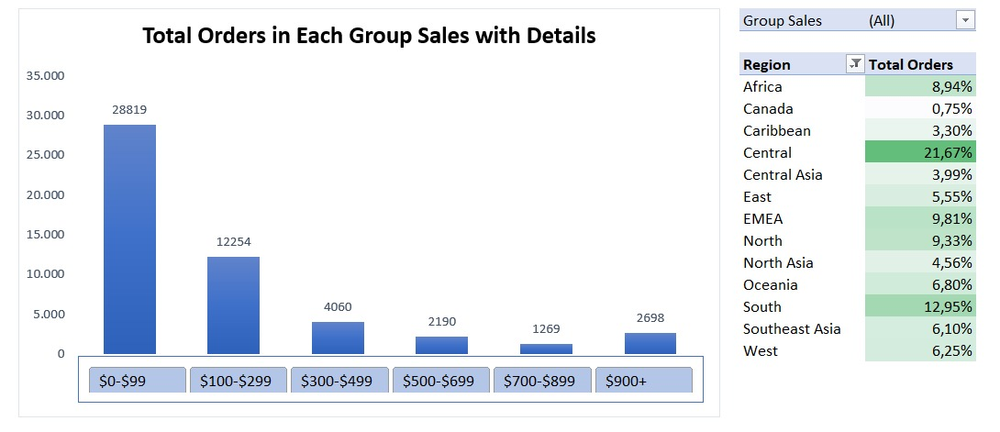
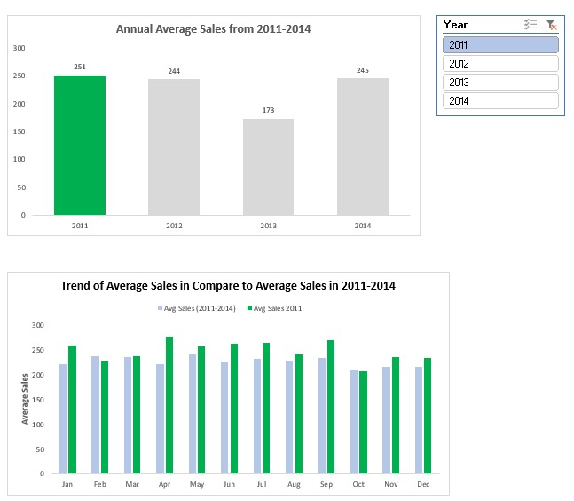
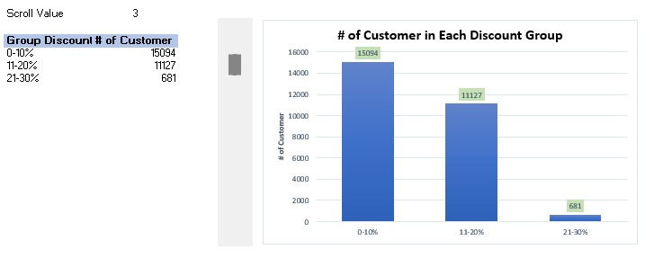

# 📊 Global Superstore Advanced Analytics (Advanced Excel Interactive Charts)

## 📌 Project Overview
Proyek ini menganalisis data transaksi global **Global Superstore Dataset (51.285 transaksi)** menggunakan teknik **Combination Charts & Dynamic Chart Form Control** untuk menghasilkan analisis visual yang dinamis, otomatis, dan berstandar industri. 

Analisis ini melacak pertumbuhan tahunan, mengelompokkan nilai transaksi, memetakan pola musiman, serta menguji efek diskon terhadap pelanggan melalui fitur interaktif.

---

## 🛠️ Excel Features & Techniques Used

* **Data Cleaning & Standardisation:**
  * **Text to Columns Parsing:** Menguraikan data mentah berformat CSV menjadi struktur tabel terpisah yang rapi.
  * **Date Format Standardisation:** Membersihkan karakter *timestamp* (`00:00:00.000`) pada kolom `Order.Date` menjadi format *Short Date* (`YYYY-MM-DD`) pada sheet `Order Data` untuk mengaktifkan hirarki tanggal (*Year, Quarter, Month*) otomatis pada Pivot Table.
* **Feature Engineering & Data Binning:**
  * **Sales Price Binning (`Group Sales`):** Mengategorikan 51.285 transaksi ke dalam 6 kelompok harga belanja menggunakan *Nested IF*:
    ```
    =IF(Q2<99;"$0-$99";IF(Q2<299;"$100-$299";IF(Q2<499;"$300-$499";IF(Q2<699;"$500-$699";IF(Q2<899;"$700-$899";"$900+")))))
    ```
  * **Discount Transformation (`Group Discount`):** Mentransformasi variabel diskon desimal menjadi 9 rentang persentase dinamis untuk evaluasi margin:
    ```
    =IF(F2<=10%;"0-10%";IF(F2<=20%;"11-20%";IF(F2<=30%;"21-30%";IF(F2<=40%;"31-40%";IF(F2<=50%;"51-60%";IF(F2<=60%;"61-70%";IF(F2<=70%;"71-80%";IF(F2<=80%;"81-90%";"91%+"))))))))
    ```
  * **Month Mapping:** Ekstraksi nama bulan menggunakan `=TEXT(H2; "mmmm")`.
* **Advanced Charting Mechanics:**
  * **Custom Error Bars Plotting:** Mengintegrasikan seri *Invisible Bar* *Invisible Bar+* dan *Invisible Bar-* dengan *Custom Error Bars* untuk membentuk indikator panah naik-turun (*Variance Arrows*) otomatis.
  * **Dynamic Helper Title:** Mengaitkan judul chart secara dinamis pada sel tersembunyi `U22` dengan Slicer Year.
  * **Form Control Interactivity:** Menggunakan **Developer Scroll Bar** yang dihubungkan dengan rumus pencarian dinamis `=OFFSET(Advanced_Charting_Techniques!A108:B116; 0; 0; $E$105; 2)` untuk menggeser rentang baris data secara langsung di dalam chart.
* **Conditional Formatting:** Menerapkan *Green Color Scale / Data Bars* pada tabel analisis komposisi regional.

---

## 📈 Interactive Charts Showcase

### 1. YoY Sales Trend with Percentage Growth & Error Bars
Menampilkan tren penjualan tahunan global (2011–2014) yang terhubung dengan **Slicer Region**. Dilengkapi indikator panah hijau/merah (*Custom Error Bars*) dan label persentase *growth* otomatis.
* **Key Insight:** Penjualan global tumbuh pesat dari **$2.259K (2011)** ke **$2.677K (2012)** (**+18,5%**), namun turun pada **2013** menjadi **$2.384K** (**-11,0%**) akibat krisis *Global Supply Chain Bottleneck*, sebelum akhirnya melonjak tajam pada **2014** mencapai **$4.299K** (**+80,4%**).


---

### 2. Interactive Histogram with Regional Breakdown
Mengelompokkan 51.290 transaksi ke dalam 6 rentang harga belanja, dilengkapi dengan **Slicer 6-Kolom Horizontal** dan tabel rincian kontribusi *Region* menggunakan *Conditional Formatting Data Bars*.
* **Key Insight:** Distribusi menunjukkan pola *Positive Skewness* di mana **80%+ transaksi global** berada pada rentang rendah (`$0–$99` sebanyak 56,19% dan `$100–$299` sebanyak 23,89%). Terdapat anomali peningkatan di kelompok **`$900+`** (5,26%) yang mengindikasikan transaksi dari segmen *Corporate Enterprise* (pembelian grosir).



---

### 3. Annual Trend with Monthly Detail (Seasonality Benchmark)
*Combination Chart* ganda yang membandingkan rata-rata nilai penjualan per transaksi tahun berjalan dengan garis pangkal rata-rata musiman bulanan historis (2011–2014) secara dinamis via **Slicer Year**.
* **Key Insight:** Mengidentifikasi siklus musiman bisnis (*commercial seasonality*): puncak penjualan awal tahun terjadi di **Maret (Q1 Peak)**, dilanjutkan masa sepi di **April ($207)**, sebelum mencapai puncak utama pada **September ($276)** hingga **Desember ($264)** (*Year-End Holiday Peak*).



---

### 4. Frequency Distribution Chart with Scroll Bar (Form Control)
Grafik distribusi frekuensi pelanggan (*# of Customer*) berdasarkan 9 kelompok diskon yang dapat digeser secara interaktif menggunakan komponen **Form Control Scroll Bar** dan rumus `OFFSET`.
* **Key Insight:** Terjadi pola *Bimodal Distribution* (Dua Puncak Ekstrem) pada strategi promosi, di mana transaksi berpusat pada diskon standar **`0–20%` (51,13%)** dan diskon pembersihan stok lama / *deadstock liquidation* **`91%+` (40,72%)**.



---

## 📁 Repository Structure

* `Advanced_Excel_Global_Superstore_Analytics.xlsx` : File kerja utama Excel.
* **`Order Data`** : Sheet data mentah (*raw data*) 51.285 baris transaksi setelah *cleaning* & *feature engineering*.
* **`Advanced_Charting_Techniques`** : Sheet utama berisi *staging tables*, Pivot Tables, Slicers, Form Controls, dan 4 *Advanced Dynamic Charts*.
* 📝 **Medium Article:** [Sematkan Tautan Artikel Medium Kamu di Sini]
