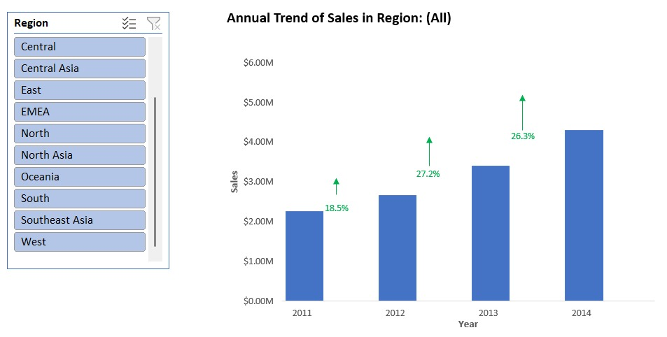

# 📊 Global Superstore Advanced Analytics (Advanced Excel Interactive Charts)

## 📌 Project Overview
Proyek ini menganalisis data transaksi e-commerce global dari **Global Superstore Dataset (51.290 transaksi)** menggunakan kombinasi teknik **Advanced Excel Charting, Form Control, & Dynamic Data Lookup** untuk menghasilkan analisis visual yang interaktif, otomatis, dan berstandar industri. 

Analisis ini melacak tren pertumbuhan omset tahunan (2011–2014), mengelompokkan nilai keranjang belanja (*price binning*), memetakan pola musiman (*seasonality pattern*), serta mengevaluasi efektivitas dan dampak kebijakan diskon terhadap marjin keuntungan perusahaan.

---

## 🛠️ Excel Features & Techniques Used

* **Feature Engineering & Data Binning:**
  * **Sales Price Binning (`Group Sales`):** Mengelompokkan 51.290 transaksi ke dalam 6 rentang harga belanja menggunakan *Nested IF*:
    ```excel
    =IF(Q2<99;"$0-$99";IF(Q2<299;"$100-$299";IF(Q2<499;"$300-$499";IF(Q2<699;"$500-$699";IF(Q2<899;"$700-$899";"$900+")))))
    ```
  * **Discount Rate Binning (`Group Discount`):** Mentransformasi variabel diskon desimal menjadi kelompok persentase diskon untuk evaluasi marjin:
    ```excel
    =IF(F2<=0.1;"0-10%";IF(F2<=0.2;"11-20%";IF(F2<=0.3;"21-30%";IF(F2<=0.4;"31-40%";IF(F2<=0.5;"41-50%";IF(F2<=0.6;"51-60%";IF(F2<=0.7;"61-70%";IF(F2<=0.8;"71-80%";"81%++"))))))))
    ```
  * **Month Extraction:** Mengekstrak nama bulan menggunakan `=TEXT(H2; "mmmm")`.
* **Advanced Charting Mechanics:**
  * **Custom Error Bars Plotting:** Mengintegrasikan seri *Invisible Bar*, *Invisible Bar+*, dan *Invisible Bar-* dengan *Custom Error Bars (Direction: Plus/Minus)* untuk membentuk indikator panah naik-turun (*Variance Arrows*) otomatis.
  * **Dynamic Helper Title:** Mengaitkan judul chart secara dinamis pada sel tersembunyi `U22` yang terhubung dengan Slicer Year.
  * **Form Control Interactivity:** Menggunakan **Developer Scroll Bar** yang dihubungkan dengan rumus pencarian dinamis `=OFFSET(Advanced_Charting_Techniques!A108:B116; 0; 0; $E$105; 2)` untuk menggeser rentang baris data secara langsung di dalam chart.
* **Conditional Formatting:** Menerapkan *Green Color Scale / Data Bars* pada tabel analisis komposisi regional.

---

## 📈 Interactive Charts Showcase

### 1. YoY Sales Trend with Percentage Growth & Error Bars
Menampilkan tren penjualan tahunan global (2011–2014) yang terhubung dengan **Slicer Region**. Dilengkapi indikator panah hijau/merah (*Custom Error Bars*) dan label persentase *growth* otomatis.
* **Key Insight:** Penjualan global menunjukkan tren pertumbuhan yang konsisten dan berkelanjutan dari **$2.259K (2011)** naik ke **$2.677K (2012)** (**+18,5%**), berlanjut naik ke **$3.405K (2013)** (**+27,2%**), dan mencapai puncak **$4.299K (2014)** (**+26,2%**). Wilayah **Central** mendominasi omset terbesar ($938,4K pada 2014), sedangkan **EMEA (+47,4%)** dan **Southeast Asia (+43,5%)** mencatatkan ekspansi persentase terpesat pada 2013–2014.



---

### 2. Interactive Histogram with Regional Breakdown
Mengelompokkan 51.290 transaksi ke dalam 6 rentang harga belanja (*price bins*), dilengkapi dengan **Slicer 6-Kolom Horizontal** dan tabel rincian kontribusi *Region* menggunakan *Conditional Formatting Color Scales*.
* **Key Insight:** Sektor belanja rendah hingga menengah menguasai **80,08%** dari total volume transaksi global (`$0–$99` sebesar **56,19%** dan `$100–$299` sebesar **23,89%**). Terdapat anomali transaksi tinggi pada kelompok **`$900+`** (**5,26%**) yang melampaui kelompok `$500–$699` (4,27%), menandakan adanya aktivitas pembelian inventaris skala besar oleh segmen *Corporate Enterprise*.


---

### 3. Annual Trend with Monthly Detail (Seasonality Benchmark)
*Combination Chart* ganda yang membandingkan total penjualan bulanan per tahun dengan garis pangkal rata-rata musiman bulanan historis (2011–2014) secara dinamis via **Slicer Year**.
* **Key Insight:** Mengidentifikasi pola musiman bisnis (*seasonality pattern*) yang berulang setiap tahun: penjualan dimulai dari titik terendah pada awal tahun (**Februari $543,8K**), melonjak pada pertengahan tahun (**Juni & Agustus**), dan mencapai Puncak Utama (*Peak Season*) pada kuartal keempat (**November $1.551M** dan **Desember $1.580M**) akibat penyerapan anggaran korporat dan belanja musim liburan.


---

### 4. Frequency Distribution Chart with Scroll Bar (Form Control)
Grafik distribusi frekuensi pelanggan (*# of Customer*) berdasarkan kelompok diskon yang dapat digeser secara interaktif menggunakan komponen **Form Control Scroll Bar** dan rumus `OFFSET`.
* **Key Insight:** Penjualan didominasi oleh kelompok diskon rendah **`0–10%` (65,69%)** dan **`11–20%` (12,22%)** yang menjadi penopang utama profitabilitas perusahaan (menyumbang **155,53%** dari total profit). Sebaliknya, pemberian diskon **> 20%** terbukti secara akumulatif menggerus profit sebesar **-55,52%** (menghasilkan profit negatif/rugi).


---

## 💡 Summary of Strategic Recommendations
1. **Discount Capping (Max 20%):** Membatasi diskon maksimal 20% untuk transaksi umum dan menerapkan *bundling* dengan kategori ber-marjin tinggi seperti **Technology (13,99%)**.
2. **AOV Improvement:** Mendorong kenaikan *basket size* transaksi dari rentang $0–$99 (56,19%) naik ke $100–$299 melalui program *Up-selling* & *Cross-selling*.
3. **Seasonality Inventory Planning:** Mempersiapkan stok dan armada logistik sejak bulan **Agustus–September** untuk mengantisipasi puncak lonjakan transaksi di Q4 (November–Desember).
4. **Regional Budget Allocation:** Mempertahankan ketersediaan stok di wilayah utama (**Central, South, North**) serta meningkatkan investasi pemasaran pada wilayah dengan pertumbuhan persentase tertinggi (**EMEA** dan **Southeast Asia**).

---

## 📁 Repository Structure

* 📊 `Advanced_Excel_Global_Superstore_Analytics.xlsx` : File kerja utama Excel.
* 📄 **`Order Data`** : Sheet data mentah (*raw data*) 51.290 baris transaksi setelah *cleaning* & *feature engineering*.
* 📈 **`Advanced_Charting_Techniques`** : Sheet utama berisi *staging tables*, Pivot Tables, Slicers, Form Controls, dan 4 *Advanced Dynamic Charts*.
* 📝 **Full Article & Case Study on Medium:** [Analyzing Global Superstore Dynamic Performance in Excel](https://medium.com/@alenamansika723/analyzing-global-superstore-dynamic-performance-in-excel-an-advanced-charting-interactive-fed6206a4665?postPublishedType=repub)

---

## 👤 Author
- **GitHub:** [@alenamansika](https://github.com/alenamansika)
- **LinkedIn:** (https://www.linkedin.com/in/alenamansika)*
